# Vivacity: AI mock interviewer

Upload your resume, pick a role and a company, and answer three interview questions written from *your* experience. Vivacity scores each answer out of 10, says what was good, what was missing and what a stronger answer looks like, then builds a study roadmap for your weak spots. A dashboard tracks your progress, and a leaderboard compares best scores (names only).

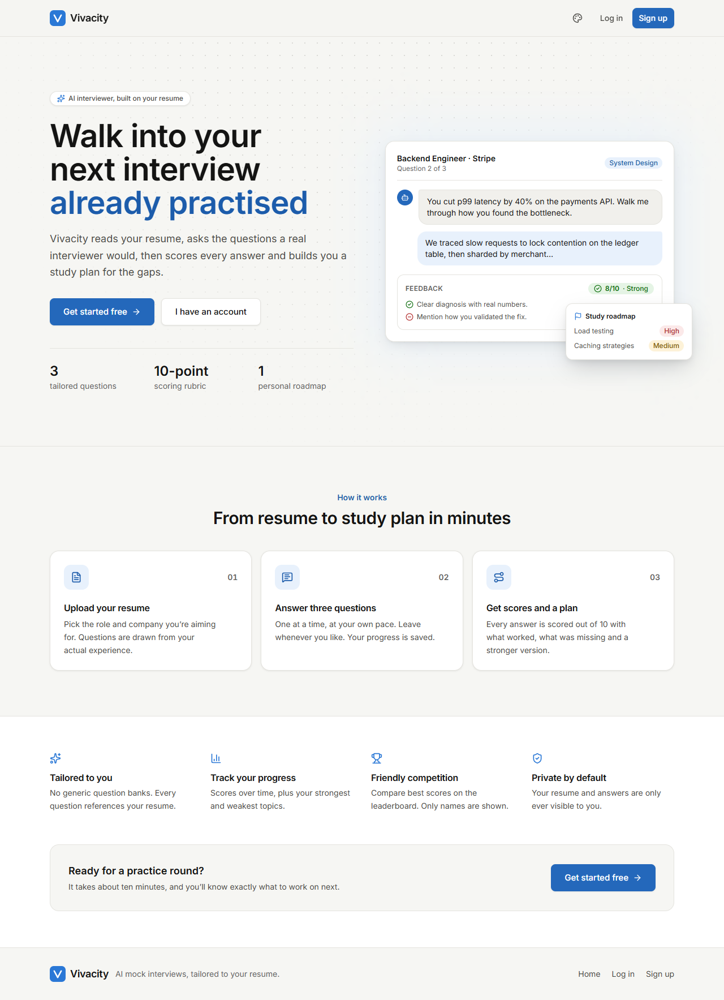

---

## Contents

1. [Features](#features)
2. [How it works](#how-it-works)
3. [Architecture](#architecture)
4. [Getting started](#getting-started)
5. [Deployment](#deployment)
6. [API reference](#api-reference)
7. [Security](#security)
8. [Testing](#testing)
9. [Project structure](#project-structure)
10. [Screenshots](#screenshots)
11. [Known limitations](#known-limitations)

---

## Features

| | |
|---|---|
| **Resume-based questions** | The PDF is parsed and three questions are generated from your actual projects, tech and results, tailored to the role and company. |
| **One question at a time** | A chat-style interview. Drafts autosave, and the interview survives refreshes, closed tabs and server restarts. |
| **Scored feedback** | Each answer gets a score out of 10, *what was good*, *what was missing* and *a stronger answer* grounded in your resume. |
| **Study roadmap** | Weak topics become a prioritised plan with study steps, resources and estimated hours. |
| **Progress dashboard** | Score over time (chart or table), strongest and weakest topics, and full interview history. You can delete interviews. |
| **Leaderboard** | Best scores by week, month or all time, filterable by role and company. It shows names only, never emails. |
| **Sign-in options** | Email and password, Google or GitHub, plus password reset with a one-time code. |
| **Five themes** | Light, Dark, Solarized Light, Solarized Dark and Parchment (beige and brown), or follow the system setting. |
| **Accessible** | WCAG 2.2 AA, checked automatically on every page in every theme. Full keyboard support, with screen-reader announcements for route changes and toasts. |

---

## How it works

### The user's journey

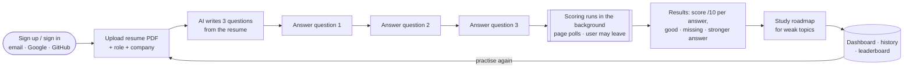
```mermaid
flowchart LR
    A([Sign up / sign in<br/>email · Google · GitHub]) --> B[Upload resume PDF<br/>+ role + company]
    B --> C[AI writes 3 questions<br/>from the resume]
    C --> D[Answer question 1]
    D --> E[Answer question 2]
    E --> F[Answer question 3]
    F --> G[[Scoring runs in the background<br/>page polls · user may leave]]
    G --> H[Results: score /10 per answer,<br/>good · missing · stronger answer]
    H --> I[Study roadmap<br/>for weak topics]
    I --> J[(Dashboard · history<br/>· leaderboard)]
    J -->|practise again| B
```

### One interview, end to end

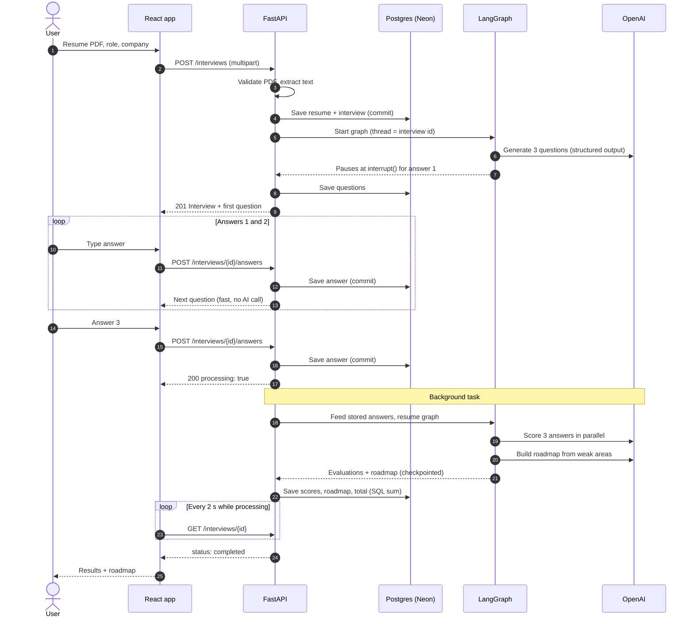
```mermaid
sequenceDiagram
    autonumber
    actor U as User
    participant W as React app
    participant A as FastAPI
    participant DB as Postgres (Neon)
    participant G as LangGraph
    participant L as OpenAI

    U->>W: Resume PDF, role, company
    W->>A: POST /interviews (multipart)
    A->>A: Validate PDF, extract text
    A->>DB: Save resume + interview (commit)
    A->>G: Start graph (thread = interview id)
    G->>L: Generate 3 questions (structured output)
    G-->>A: Pauses at interrupt() for answer 1
    A->>DB: Save questions
    A-->>W: 201 Interview + first question

    loop Answers 1 and 2
        U->>W: Type answer
        W->>A: POST /interviews/{id}/answers
        A->>DB: Save answer (commit)
        A-->>W: Next question (fast, no AI call)
    end

    U->>W: Answer 3
    W->>A: POST /interviews/{id}/answers
    A->>DB: Save answer (commit)
    A-->>W: 200 processing: true
    Note over A,L: Background task
    A->>G: Feed stored answers, resume graph
    G->>L: Score 3 answers in parallel
    G->>L: Build roadmap from weak areas
    G-->>A: Evaluations + roadmap (checkpointed)
    A->>DB: Save scores, roadmap, total (SQL sum)

    loop Every 2 s while processing
        W->>A: GET /interviews/{id}
    end
    A-->>W: status: completed
    W-->>U: Results + roadmap
```

If any AI step fails, nothing is lost. The answers are already in SQL and every graph step is checkpointed in Postgres. The interview shows a **Retry** button, and `POST /interviews/{id}/retry` resumes from the step that failed without redoing finished ones.

### The LangGraph state machine

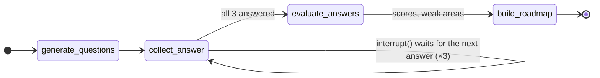
```mermaid
stateDiagram-v2
    direction LR
    [*] --> generate_questions
    generate_questions --> collect_answer
    collect_answer --> collect_answer: interrupt() waits for the next answer (×3)
    collect_answer --> evaluate_answers: all 3 answered
    evaluate_answers --> build_roadmap: scores, weak areas
    build_roadmap --> [*]
```

- **Structured output.** Every model call returns a strict JSON schema (`app/agents/schemas.py`). Ranges are clamped in the graph.
- **Editable prompts.** Prompts are Markdown files in `backend/app/agents/prompts/`, so you can tune them without touching Python.
- **Weak areas.** A weak area is the topic of any answer scoring below 7, plus the evaluator's suggested topics, de-duplicated and capped at 6.

---

## Architecture

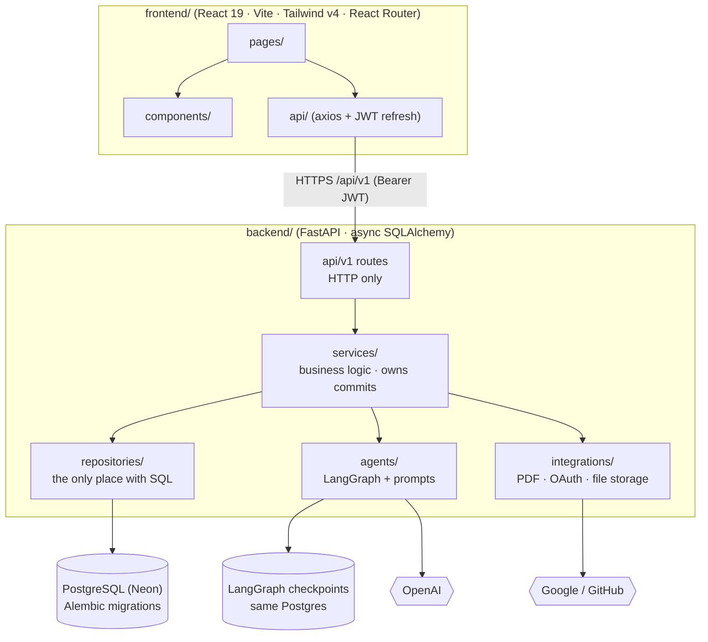
```mermaid
flowchart TB
    subgraph Frontend["frontend/ (React 19 · Vite · Tailwind v4 · React Router)"]
        Pages[pages/] --> Components[components/]
        Pages --> ApiLayer["api/ (axios + JWT refresh)"]
    end

    ApiLayer -- "HTTPS /api/v1 (Bearer JWT)" --> Routes

    subgraph Backend["backend/ (FastAPI · async SQLAlchemy)"]
        Routes["api/v1 routes<br/>HTTP only"] --> Services["services/<br/>business logic · owns commits"]
        Services --> Repos["repositories/<br/>the only place with SQL"]
        Services --> Agents["agents/<br/>LangGraph + prompts"]
        Services --> Integrations["integrations/<br/>PDF · OAuth · file storage"]
    end

    Repos --> PG[("PostgreSQL (Neon)<br/>Alembic migrations")]
    Agents --> CP[("LangGraph checkpoints<br/>same Postgres")]
    Agents --> OpenAI{{OpenAI}}
    Integrations --> OAuth{{Google / GitHub}}
```

**The layering is strict: routes → services → repositories → database.** Routes never touch the database. Agents and integrations never touch the database. Analytics and leaderboard maths (sums, averages, ranks) run in SQL.

| Layer | Technology |
|---|---|
| API | FastAPI 0.142, Pydantic v2, pydantic-settings |
| Database | PostgreSQL on Neon, SQLAlchemy 2 (async, asyncpg), Alembic |
| AI | LangGraph 1.x with the Postgres checkpointer, LangChain OpenAI (`gpt-4o-mini` by default) |
| Auth | Argon2id passwords, JWT access tokens, rotating opaque refresh tokens, Google and GitHub OAuth, OTP password reset |
| Frontend | React 19, TypeScript, Vite, Tailwind CSS v4, React Router, axios, lucide icons |
| Testing | pytest (SQLite + fake LLM), Playwright + axe-core browser suite |

### Data model

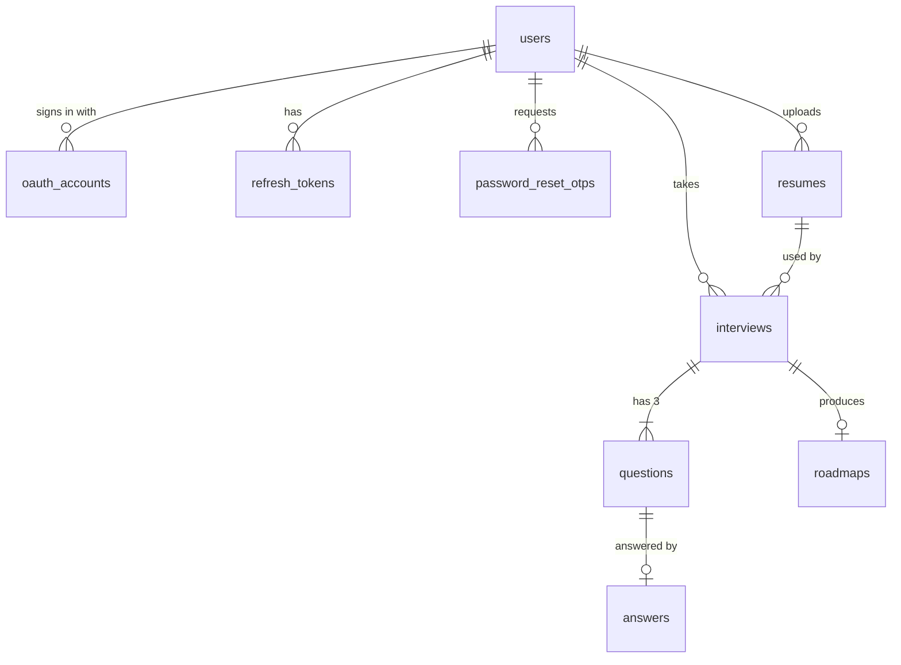
```mermaid
erDiagram
    users ||--o{ oauth_accounts : "signs in with"
    users ||--o{ refresh_tokens : has
    users ||--o{ password_reset_otps : requests
    users ||--o{ resumes : uploads
    users ||--o{ interviews : takes
    resumes ||--o{ interviews : "used by"
    interviews ||--|{ questions : "has 3"
    questions ||--o| answers : "answered by"
    interviews ||--o| roadmaps : produces
```

---

## Getting started

### Prerequisites

- Python 3.12+ and Node.js 20+
- A PostgreSQL database. A free [Neon](https://neon.tech) project works.
- An OpenAI API key. Without one the app still runs, but the interview endpoints return 503.
- *(Optional)* Google and/or GitHub OAuth client IDs.

### 1. Configure the environment

Copy the template and fill it in. `.env` lives at the repo root and is shared by the backend and Vite.

```bash
cp .env.example .env
```

| Variable | Required | Notes |
|---|---|---|
| `DATABASE_URL` | ✅ | Paste the Neon connection string as-is (`?sslmode=require` is handled). |
| `JWT_SECRET_KEY` | ✅ | At least 32 characters: `python -c "import secrets; print(secrets.token_urlsafe(64))"` |
| `OPENAI_API_KEY` | for interviews | `OPENAI_MODEL` defaults to `gpt-4o-mini`. |
| `GOOGLE_CLIENT_ID` / `_SECRET` | optional | Callback: `http://localhost:8000/api/v1/auth/google/callback` |
| `GITHUB_CLIENT_ID` / `_SECRET` | optional | Callback: `http://localhost:8000/api/v1/auth/github/callback` |
| `RATE_LIMIT_ENABLED` | | `true` by default. |
| `DOCS_ENABLED` | | Swagger at `/docs`. Set to `false` in production. |

Leave a provider's client ID empty to disable it.

### 2. Backend

```bash
cd backend
python -m venv .venv
.venv/Scripts/python -m pip install -r requirements-dev.txt   # macOS/Linux: .venv/bin/python
.venv/Scripts/alembic upgrade head                            # create the tables
.venv/Scripts/uvicorn app.main:app --reload                   # http://localhost:8000/docs
```

> **Windows:** the checkpointer's psycopg driver needs the selector event loop. `--reload` already uses it. Without `--reload`, add `--loop asyncio:SelectorEventLoop`.

### 3. Frontend

```bash
cd frontend
npm install
npm run dev        # http://localhost:5173
```

### 4. Try it

1. Open <http://localhost:5173> and sign up.
2. Upload a text-based PDF resume (scanned PDFs aren't supported), then enter a role and a company.
3. Answer the three questions. Feedback arrives 10–20 seconds after the last answer.
4. Forgot your password? Locally, the one-time code is **printed in the backend console**. To email it instead, set `BREVO_API_KEY` and `EMAIL_FROM`.

---

## Deployment

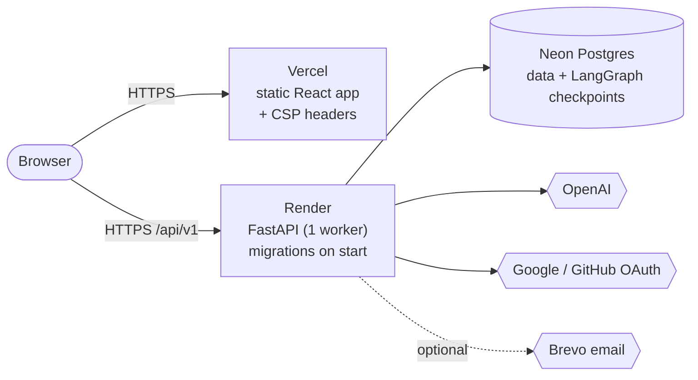
```mermaid
flowchart LR
    U([Browser]) -->|HTTPS| V["Vercel<br/>static React app<br/>+ CSP headers"]
    U -->|"HTTPS /api/v1"| R["Render<br/>FastAPI (1 worker)<br/>migrations on start"]
    R --> N[("Neon Postgres<br/>data + LangGraph checkpoints")]
    R --> O{{OpenAI}}
    R --> G{{"Google / GitHub OAuth"}}
    R -.->|optional| B{{"Brevo email"}}
```

The backend must run on an always-on server, not serverless functions, because scoring finishes in a background task after the response is sent.

### 1. Backend on Render

1. On [Render](https://render.com), choose **New → Blueprint** and pick this repository. It reads [`render.yaml`](render.yaml).
2. Fill in the values it asks for:

   | Variable | Value |
   |---|---|
   | `DATABASE_URL` | Your Neon connection string |
   | `OPENAI_API_KEY` | Your OpenAI key |
   | `OAUTH_REDIRECT_BASE_URL` | `https://<service>.onrender.com/api/v1` |
   | `FRONTEND_URL`, `CORS_ORIGINS` | Your Vercel URL, e.g. `https://vivacity.vercel.app`. Use a placeholder until step 2 gives you the real one. |
   | Google/GitHub IDs and secrets | The **production** OAuth clients (step 3) |
   | `BREVO_API_KEY`, `EMAIL_FROM` | Optional: email reset codes instead of logging them |

   `JWT_SECRET_KEY` is generated for you. API docs are turned off in production.
3. Deploy, then open `https://<service>.onrender.com/api/v1/health`. It should return `{"status":"ok","database":"ok"}`.

### 2. Frontend on Vercel

1. On [Vercel](https://vercel.com), choose **Add New → Project** and import this repository.
2. Set **Root Directory** to `frontend`. Vercel detects Vite, and [`frontend/vercel.json`](frontend/vercel.json) supplies the rest.
3. Add the environment variable `VITE_API_BASE_URL` = `https://<service>.onrender.com/api/v1`, then deploy.
4. Back on Render, set `FRONTEND_URL` and `CORS_ORIGINS` to the Vercel URL. Render redeploys automatically.

### 3. Production sign-in

| Provider | Where | Callback URL |
|---|---|---|
| Google | Same OAuth client: **Authorized redirect URIs → add** | `https://<service>.onrender.com/api/v1/auth/google/callback` |
| GitHub | A **second** OAuth app (each allows one callback). Homepage: your Vercel URL | `https://<service>.onrender.com/api/v1/auth/github/callback` |

While Google's consent screen is in *Testing*, only listed test users can sign in. Choose **Publish app** to open it to everyone.

> **Render's free plan** sleeps after 15 minutes without traffic, so the first request after a pause takes about a minute. Uploaded PDFs are kept on the instance's disk, which is wiped on each deploy. Interviews are unaffected, because the resume text is stored in the database.

---

## API reference

All routes are under `/api/v1`. Interactive docs are at `/docs` while `DOCS_ENABLED=true`.

| Method | Path | What it does |
|---|---|---|
| `GET` | `/health` | API and database status |
| `POST` | `/auth/register` | Create an account and return an access/refresh pair |
| `POST` | `/auth/login` | Email + password sign-in |
| `POST` | `/auth/refresh` | Rotate the refresh token (replaying an old one signs out every session) |
| `POST` | `/auth/logout` | Revoke a refresh token |
| `POST` | `/auth/forgot-password` | Send a 6-digit reset code (same response whether or not the email exists) |
| `POST` | `/auth/reset-password` | Reset with the code (5 tries, 10 minutes, single use) |
| `GET` | `/auth/{google\|github}/login` | Start OAuth. Redirects back to `/oauth/callback#access_token=…` |
| `GET` / `PATCH` | `/users/me` | Your profile, and set your leaderboard display name |
| `POST` | `/interviews` | Upload a resume (multipart) and get the interview with 3 questions |
| `GET` | `/interviews` | Your interviews, paginated |
| `GET` | `/interviews/{id}` | One interview. Poll while `processing` is `true` |
| `POST` | `/interviews/{id}/answers` | Answer the next question. The 3rd answer starts scoring in the background |
| `POST` | `/interviews/{id}/retry` | Resume after an AI failure |
| `GET` | `/interviews/{id}/roadmap` | The study roadmap |
| `DELETE` | `/interviews/{id}` | Delete an interview with its resume file and checkpoint |
| `GET` | `/analytics/me` | Summary, score history, and strong and weak topics |
| `GET` | `/leaderboard` | `?period=week\|month\|all&role=&company=&limit=` |

---

## Security

- **Passwords** are hashed with Argon2id. Login runs a dummy hash for unknown emails, so response timing doesn't reveal which accounts exist.
- **Tokens:**
  - The access token is a short-lived JWT (30 minutes, HS256, secret of at least 32 characters).
  - The refresh token is opaque, stored only as a hash, and rotated on every use. Reusing an old one revokes all of that user's sessions.
  - A password reset also signs out everywhere.
- **Password reset codes** are HMAC-hashed, expire after 10 minutes, allow at most 5 attempts (counted atomically), and are single-use.
- **OAuth:**
  - A `state` cookie (HttpOnly, SameSite=Lax) protects the flow.
  - Tokens come back in the URL fragment, which is never sent to servers or logs, and the app clears it immediately.
  - An existing account is linked only when the provider says the email is verified.
- **Rate limits:**
  - per IP on login, signup, refresh and password reset
  - per email on login and password reset, so a forged `X-Forwarded-For` can't get around them, and nobody can flood an inbox with reset codes
  - per user on starting, answering and retrying interviews, which spend OpenAI credits

  Exceeding a limit returns `429` with `Retry-After`.
- **Content Security Policy** on the deployed frontend: scripts load only from the app's own origin, with no inline scripts allowed. This limits the damage of any cross-site scripting bug, which matters because sign-in tokens live in browser storage.
- **Data isolation:** every interview query is filtered by its owner, and other users' interviews return `404`, not `403`, so ids can't be probed. The leaderboard shows names only.
- **Uploads:**
  - PDFs are checked by magic bytes and size (5 MB), and read with a capped number of pages.
  - Files are stored under generated names, so nothing from the user's filename reaches the filesystem.
  - Deletes refuse any path outside the upload folder.
- **Prompt injection:**
  - Resumes and answers sit inside delimiter tags that they can't close (`</resume>` inside a resume is defanged).
  - The prompts tell the model to treat that text as data.
  - Role and company names are flattened to one line.
- **HTTP hardening:**
  - Responses carry `X-Content-Type-Options: nosniff`, `X-Frame-Options: DENY` and `Referrer-Policy: no-referrer`.
  - API responses also carry `Cache-Control: no-store`.
  - CORS allows only the configured frontend origin and only the methods and headers the app uses.
- **Secrets** live only in `.env`, which is git-ignored. `.env.example` holds placeholders.

Both `npm audit` and `pip-audit` report no known vulnerabilities in the pinned dependencies.

---

## Testing

```bash
# Backend: 113 tests on in-memory SQLite with a fake LLM. No network, no .env, no OpenAI.
cd backend && .venv/Scripts/python -m pytest

# Frontend
cd frontend
npm run lint             # oxlint, zero warnings
npm run build            # type-check + production build
npm run check:contrast   # WCAG AA contrast for every theme's colour tokens
npm run e2e              # 176 browser checks (see below)
```

`npm run e2e` starts a throwaway API (SQLite and a stand-in model) and the Vite dev server, then drives Microsoft Edge through every flow on desktop and on a phone-sized screen:
- sign-up, upload, chat, refresh survival, background scoring and results
- dashboard, history, deleting, leaderboard and settings
- theme switching, keyboard-only menus, auto-logout and password reset

It also runs **axe-core (WCAG 2.2 AA)** on every page in every theme. Screenshots are saved to `frontend/e2e/screenshots/`.

---

## Project structure

```
Vivacity/
├── .env.example            # every setting, with placeholders
├── render.yaml             # Render blueprint for the API
├── PLAN.md                 # tables, endpoint build order, design decisions
├── CLAUDE.md               # engineering rules for this repo
├── docs/screenshots/
├── backend/
│   ├── alembic/            # migrations
│   ├── app/
│   │   ├── api/            # routes (HTTP only), dependencies, rate limits
│   │   ├── services/       # business logic, owns transactions
│   │   ├── repositories/   # all SQL
│   │   ├── models/         # SQLAlchemy ORM models
│   │   ├── schemas/        # Pydantic request/response models
│   │   ├── agents/         # LangGraph graph, LLM wrapper, prompts/*.md
│   │   ├── integrations/   # PDF parsing, OAuth providers, file storage
│   │   └── core/           # config, security, errors, rate limiter
│   └── tests/              # pytest suite + e2e test server
└── frontend/
    ├── vercel.json         # SPA rewrite, security headers, CSP
    ├── e2e/run.mjs         # browser suite (Playwright + axe-core)
    ├── scripts/            # theme contrast checker
    └── src/
        ├── api/            # every HTTP call lives here
        ├── context/        # auth, theme, toast
        ├── components/     # ui/, layout/, auth/, interview/, dashboard/, theme/
        ├── pages/          # one lazy-loaded chunk per page
        └── theme/          # theme catalogue
```

---

## Screenshots

These come from the automated browser run, which uses a stand-in model, so the questions and answers are placeholders.

| | |
|---|---|
| **Sign in** (email, Google or GitHub)<br/>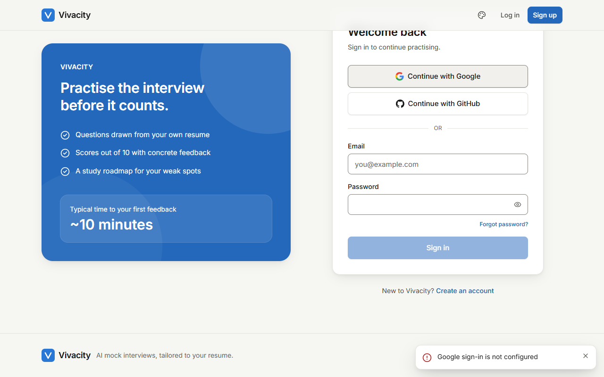 | **Start an interview** (resume, role, company)<br/>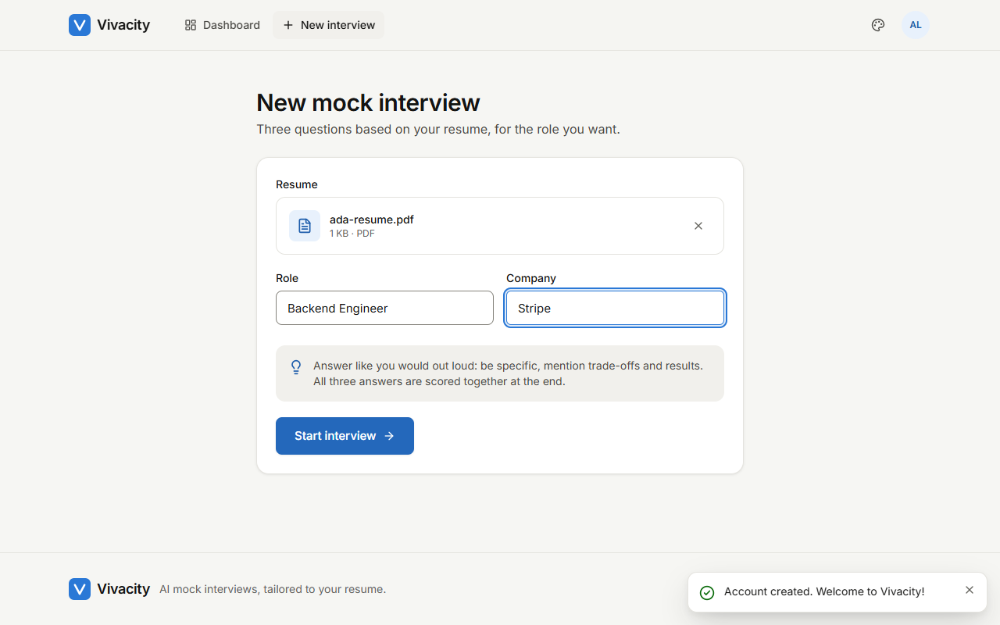 |
| **One question at a time** (drafts autosave)<br/>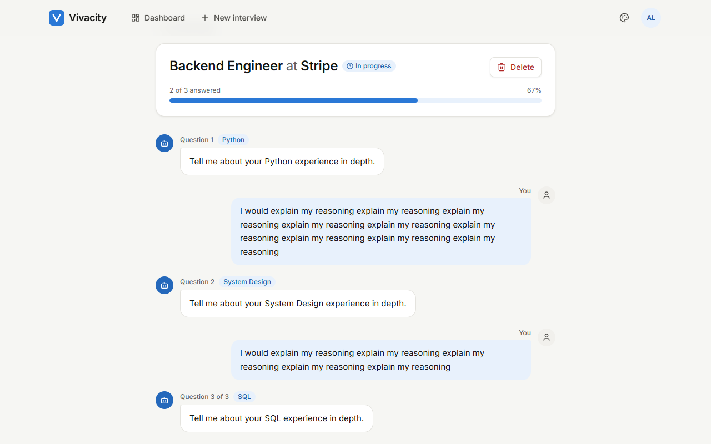 | **Scoring runs in the background**<br/>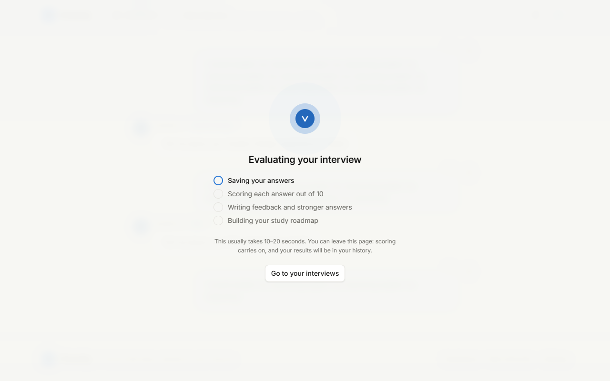 |
| **Dashboard** (progress, strong and weak topics)<br/>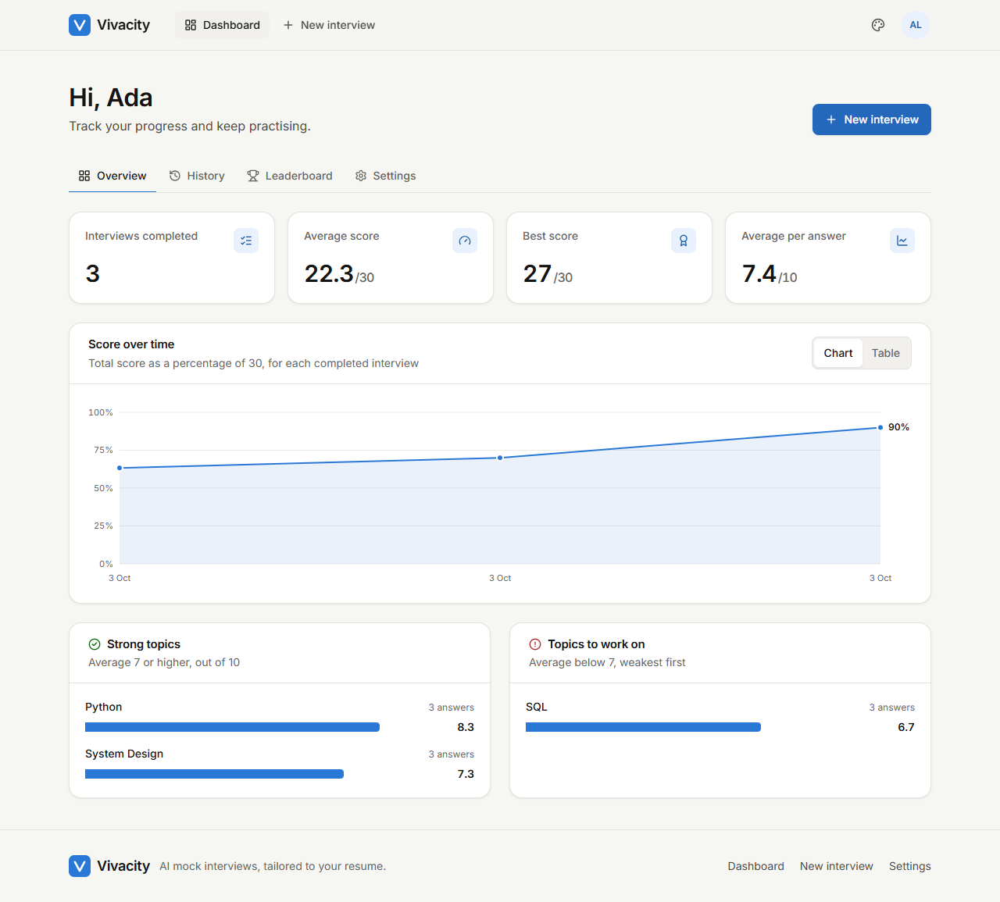 | **History** (continue or delete)<br/>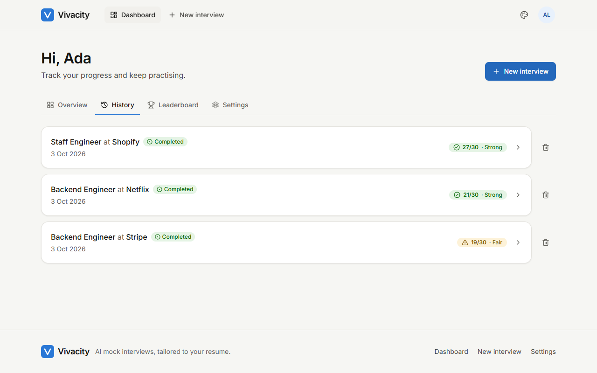 |
| **Leaderboard** (names only)<br/>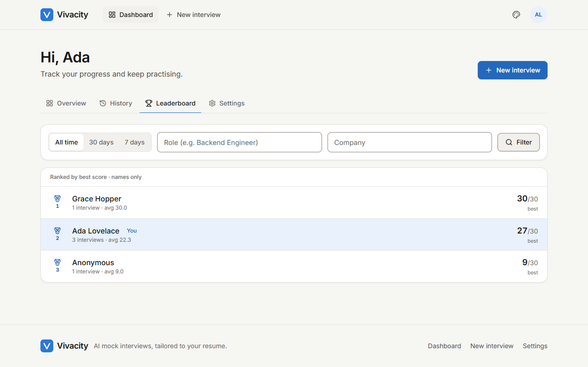 | **Delete with confirmation**<br/>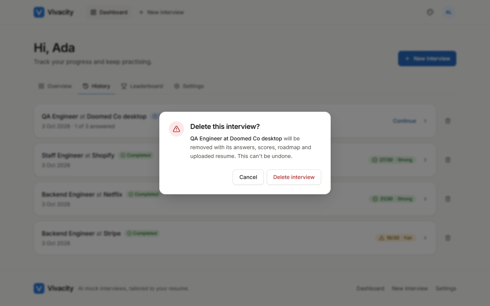 |

**Results, feedback and roadmap**

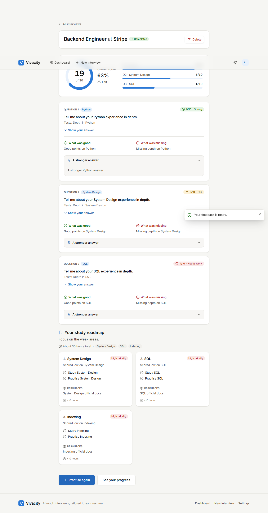

**Themes**

| Dark | Solarized Dark | Parchment |
|---|---|---|
| 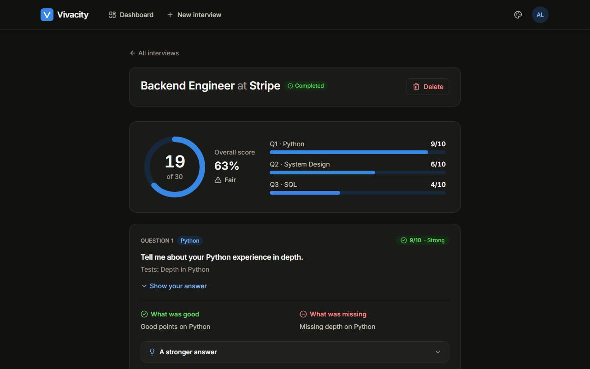 | 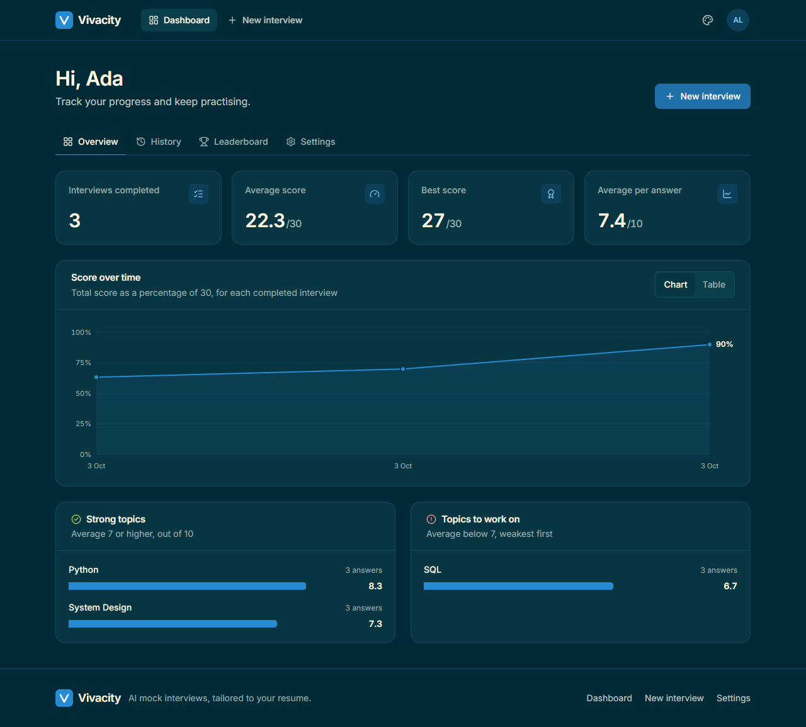 | 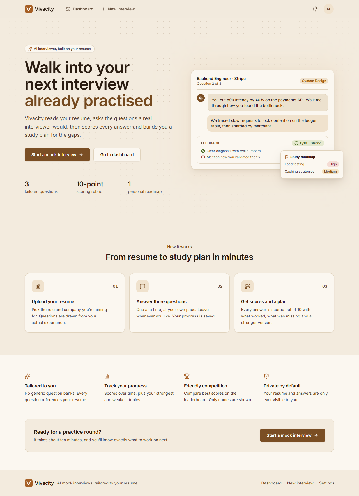 |

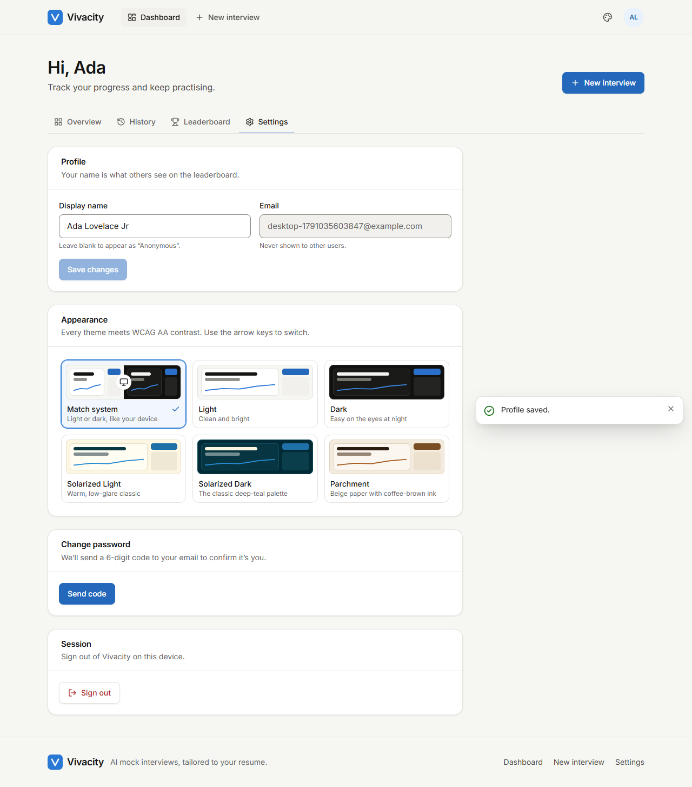

**Mobile**

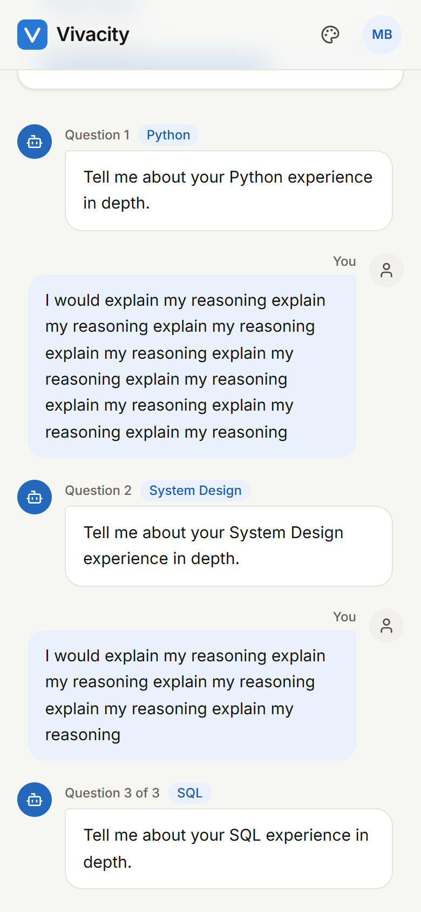 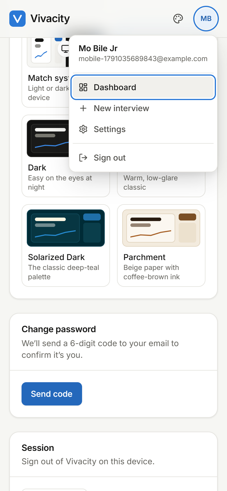

---

## Known limitations

- **Google and GitHub sign-in haven't been run against the live providers.** The flow and the HTTP exchange with both providers are covered by tests against mocked responses. To use them, register the callback URLs above and add the client IDs to `.env`.
- **Password-reset email is optional.** Without `BREVO_API_KEY` and `EMAIL_FROM`, codes go to the server log, which users can't see.
- **Single API instance.** Rate limits and "is this interview being scored right now" are kept in memory. That's fine for one server; behind a load balancer, move both to Redis. A restart mid-scoring is safe, because the interview just shows a Retry button.
- **Resumes are stored on local disk** (`backend/uploads/`), which is lost on each Render deploy. The resume *text* is kept in the database, so nothing breaks; for permanent PDFs, swap `app/integrations/file_storage.py` for object storage.
- **Text-based PDFs only.** Scanned or image-only resumes are rejected with a clear message.

---

## License

[MIT](LICENSE) © 2026 Ayushi Maurya
